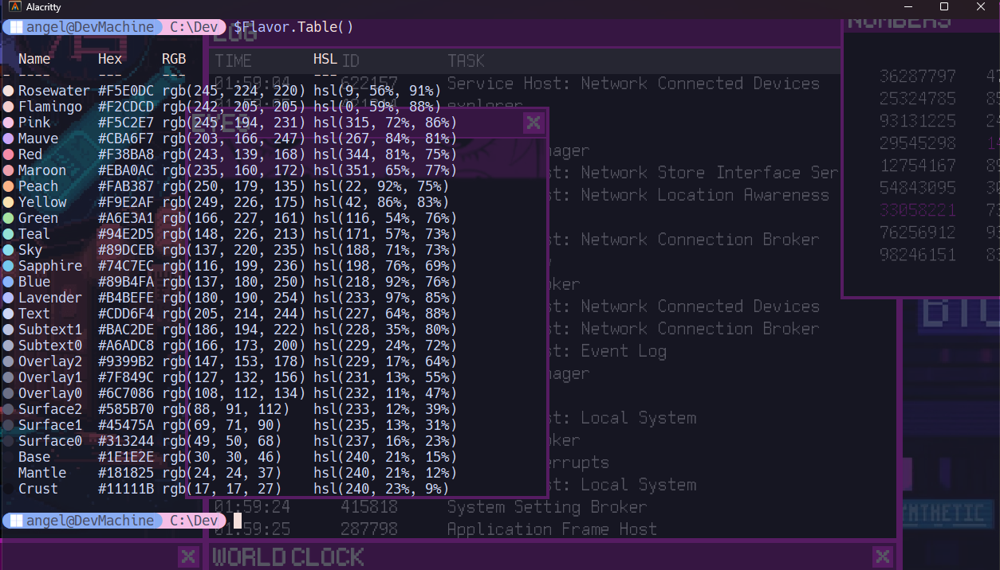

# Dotfiles
Windows dotfiles, this isn't a joke and without wsl lol.

## Install
The installation depends on each program, I will leave you the most important.

### PoweShell
First you need to install some tools:

- [z](https://github.com/JannesMeyer/z.ps) better than cd command
- [fzf](https://github.com/junegunn/fzf) list directories and files
- [fastfetch](https://github.com/fastfetch-cli/fastfetch) neofetch its dead and this work better in windows
- [onefetch](https://github.com/o2sh/onefetch) neofetch but for projects
- [lazygit](https://github.com/jesseduffield/lazygit) i don't prepare dot for this but i recommend this tool (it's git but with tui ((install [git](https://git-scm.com) before it's obvious)))

In ur poweshell use this commands:
``` bash
New-Item -Path $PROFILE -Type File -Force
notepad $PROFILE
```

Copy the content from profile.ps1 and paste in the notepad, it's all.

In addition, copy the content from fastfetch folder to this path:
``` path
%USERPROFILE%/.config/fastfetch
```


### Alacritty
I prefer [kitty](https://sw.kovidgoyal.net/kitty/) but it is not available on windows, [alacritty](https://github.com/alacritty/alacritty) is an excellent alternative.

Only copy paste the toml file to your alacritty path, maybe is this:
``` Path
%APPDATA%/alacritty
```


### Terminal
If you prefer to use windows terminal you only go to preferences > open json file.

Copy the content from terminal/settings.json.


### VS code
- Go to preferences (open json)
- Copy the content from vscode/settings.json
- Install the [apc](https://marketplace.visualstudio.com/items?itemName=drcika.apc-extension) extension


### Cider
I use apple music and the apple music client in windows it's horrible. I recommend buy cider for $3.99 usd you got this. I use the [catppuccin](https://github.com/catppuccin/cider) theme.


If you use spotify i recommend [spicetify](https://spicetify.app).

### NEOVIM
I prefer [neovim](https://neovim.io) than vscode so if you want to try neovim [checkthis](https://github.com/AngelYahir/foxy.nvim)!. I am working on a new version of this neovim configuration with many more things, I will update it in these days.


## Scheme color
I really love [catppuccin](https://catppuccin.com) scheme color. So check their page, they have ports for many tools.

